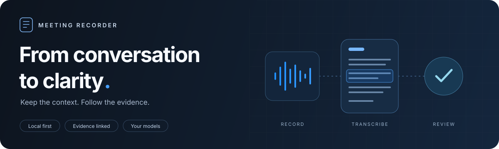
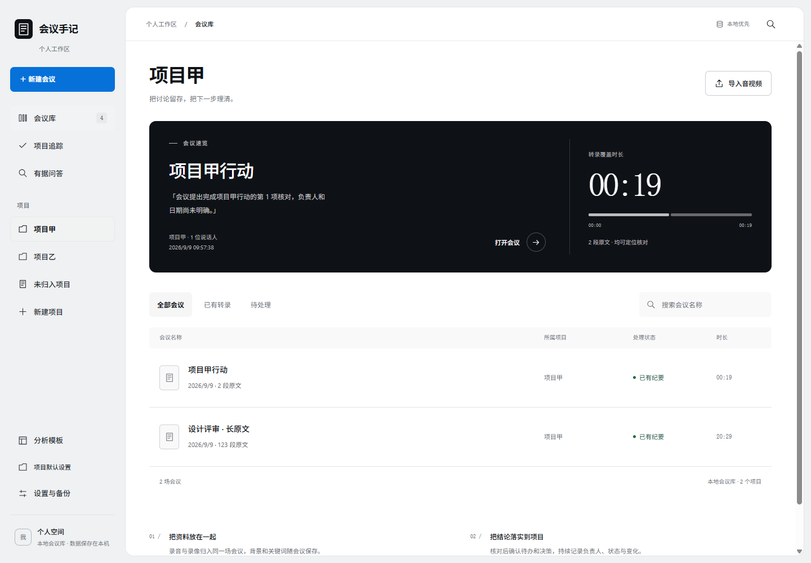
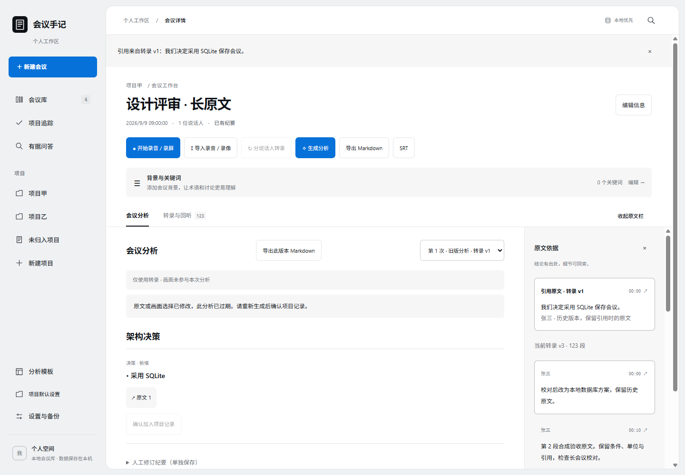
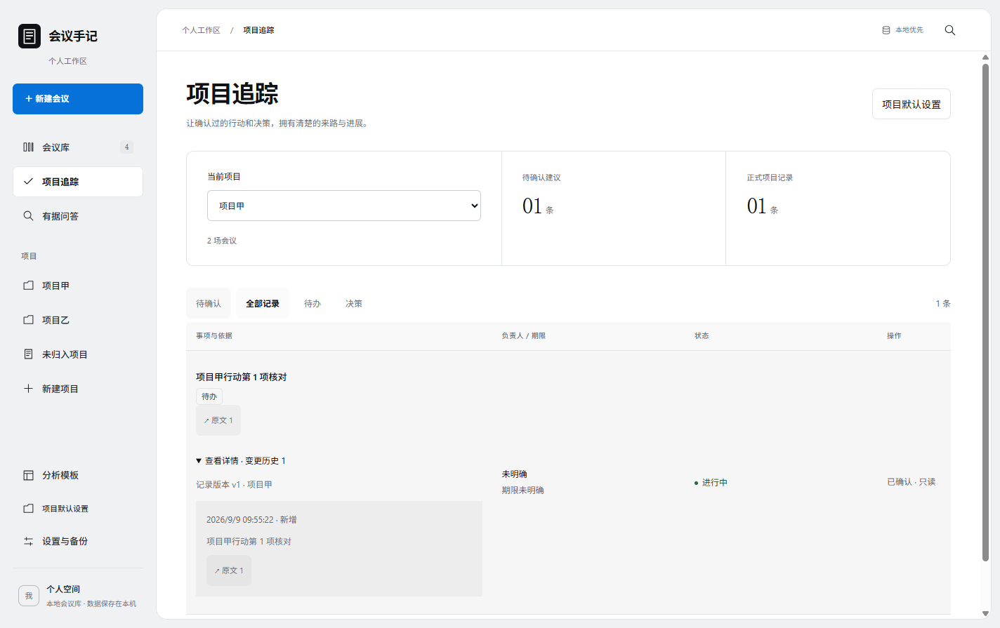
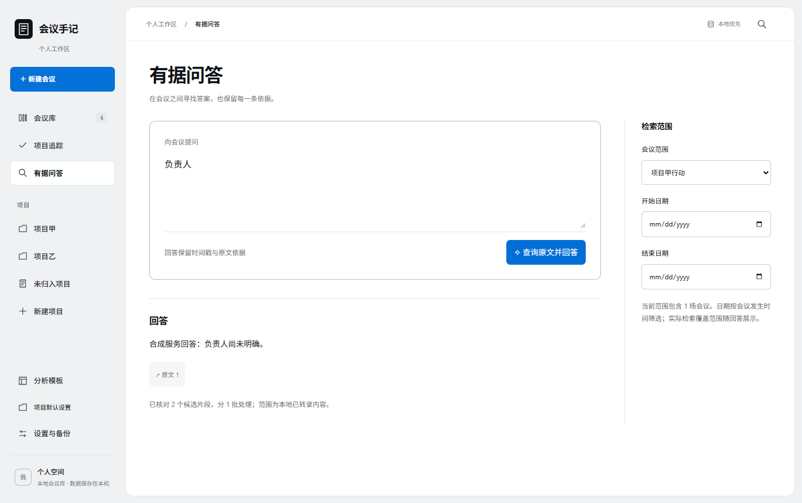

<div align="center">

# Meeting Recorder · 会议手记

**Keep the conversation. Make the next step clear.**

Local recording · Chinese & English transcription · Evidence-linked minutes

[简体中文](README.md) · [English](README.en.md)

[](LICENSE)
[](#get-started)
[](docs/bundled-asr.md)
[](#run-from-source)

[Get started](#get-started) · [Screenshots](#screenshots) · [Privacy](#your-data) · [Development](docs/development.md)

</div>



A desktop workspace for your meetings. Keep recordings, transcripts and minutes together, trace conclusions back to their sources, and carry confirmed actions into your projects.

Windows runs Chinese and English transcription locally on the CPU. Download the models once, then transcribe offline. Minutes, image analysis and Q&A use a Chat Completions compatible service you configure, including your own hosted models.

## What you can do

|                                | Features                                                                                                                                                          |
| ------------------------------ | ----------------------------------------------------------------------------------------------------------------------------------------------------------------- |
| **Capture the conversation**   | Record microphone and system audio, capture a window or display on Windows, or import existing audio and video.                                                   |
| **Transcribe and correct**     | Use Qwen3-ASR for Chinese and SenseVoice for English. Group speakers by voice, seek by timestamp, edit text and retain transcript versions.                       |
| **Read minutes with evidence** | Generate minutes from templates, expand detailed findings and citations, and review key video frames. Keep earlier versions when changing templates or languages. |
| **Follow through**             | Confirm suggested actions and decisions before they enter project records, with sources and change history.                                                       |
| **Ask across meetings**        | Search by meeting, project and date, with citations that take you back to the transcript.                                                                         |
| **Keep your library**          | Local SQLite storage, Markdown / SRT exports, full backup and restore. Set UI and report languages independently.                                                 |

## Screenshots



<details>
<summary><strong>Explore evidence, project tracking and Q&A</strong></summary>

**Trace conclusions back to the original transcript**



**Track confirmed actions and their history**



**Ask questions within a selected scope**



</details>

<sub>Screenshots show the application's design integration tests with synthetic data, in Chinese. They contain no real meetings. The current UI may differ slightly.</sub>

## Get started

| Platform                        | Status                                                                                                                                                                        |
| ------------------------------- | ----------------------------------------------------------------------------------------------------------------------------------------------------------------------------- |
| **Windows 11 x64**              | Primary distribution. Includes the transcription runtime and FFmpeg; supports local transcription and screen recording.                                                       |
| **macOS 14.2+ · Apple Silicon** | Source execution and ARM64 DMG build configuration available. Uses an external transcription service; full device acceptance testing and in-app screen recording are pending. |
| **Linux**                       | Used for CI and the optional Python service. The desktop app has not been validated.                                                                                          |

Installers are built and published through [GitLab Releases](https://gitlab.lingduyu.top/ldy/meeting-recorder/-/releases). **The upstream project is currently private, so downloads require GitLab access.** GitHub is a source mirror without separate releases. If you only have GitHub access, follow the source instructions below.

The Windows installer includes the runtime: no separate Python, CUDA or FFmpeg installation is needed. Models download on demand: approximately **1.02 GB** for Chinese, **276 MB** for English, or **1.26 GB** together with shared files. Downloads support pause, resume and integrity checks. Once downloaded, local transcription works offline.

1. **Record or import.** Create a meeting, then record audio or your screen, or import WAV, MP3, M4A, MP4, OGG, WebM or FLAC.
2. **Transcribe and review.** Select Chinese or English. Seek by timestamp and check terminology, numbers and speakers.
3. **Generate minutes.** Configure your analysis endpoint, model and key in Settings, approve the data scope, and select a template.
4. **Confirm and follow up.** Review citations, confirm actions and decisions, and use project tracking or Q&A.
5. **Export or back up.** Export Markdown / SRT, or use a full backup to move your library.

You can import the [synthetic transcript](fixtures/transcript.json) to explore editing without an ASR setup. Generating minutes still requires an analysis service.

## Your data

**The meeting library stays on your device. Model requests follow the services and permissions you configure.**

| Operation                           | Where data goes                                                                                                     |
| ----------------------------------- | ------------------------------------------------------------------------------------------------------------------- |
| Recording, import and editing       | Your local meeting library.                                                                                         |
| Built-in Windows transcription      | Your CPU; downloading models does not upload recordings.                                                            |
| Optional external transcription     | Audio is sent to your configured ASR service, locally or remotely hosted.                                           |
| Minutes, language detection and Q&A | Relevant transcript text, context, project records, questions and citations go to your configured analysis service. |
| Image analysis                      | Selected key frames go to your configured vision service, with separate image-sharing consent.                      |

Service keys are encrypted with Electron `safeStorage` and are not exposed to the renderer. **Meeting files and backups are not encrypted as a whole**; manage access to your device and files accordingly. Full backups contain meeting data, media, history and citations, but exclude service credentials and connection settings.

Default library: `%APPDATA%/meeting-recorder/library` on Windows, or `~/Library/Application Support/meeting-recorder/library` on macOS. Set `MEETING_DATA_DIR` for an isolated development or test directory.

## Run from source

Use **Node.js 24** and npm. Building the Windows transcription runtime also requires **Python 3.12**.

```sh
git clone https://github.com/ldy5413/meeting-recorder.git
cd meeting-recorder
npm ci
```

On Windows, prepare the transcription runtime and FFmpeg before the first run. Repeat after changes to Python inference code:

```powershell
npm run prepare:local-asr
```

Launch the Electron app:

```sh
npm run dev
```

macOS uses the [optional external ASR service](docs/transcription.md) and requires FFmpeg / FFprobe for media processing during development. Windows can also use external ASR through Settings.

<details>
<summary><strong>Checks and packaging</strong></summary>

```sh
npm run format:check
npm test
npm run build
# Requires a desktop environment capable of running Electron
npm run test:e2e
```

```powershell
# Windows x64 installer, written to release/
npm run dist:win -- --publish never
```

```sh
# Build on an Apple Silicon Mac
npm run dist:mac -- --publish never
```

See [development notes](docs/development.md) for Python checks, CI and test dependencies. Code signing and notarization are not guaranteed.

</details>

## Current limits

- Transcription, speaker grouping and model analysis can be wrong. Anonymous speaker labels do not establish identity, and valid citations do not guarantee correct interpretation. Review important conclusions against the recording.
- Project actions and decisions require human confirmation.
- Recently deleted meetings remain recoverable, retain their media and appear in full backups. This does not free disk space.
- This is a personal workspace. Multi-user collaboration, cloud synchronization and live interpretation are not implemented.

## Documentation and contributions

Most detailed documentation is currently in Chinese:

| Topic                                  | Documentation                                                                                       |
| -------------------------------------- | --------------------------------------------------------------------------------------------------- |
| Usage, languages, backups and recovery | [User guide](docs/usage.md)                                                                         |
| Local models and transcription         | [Windows ASR](docs/bundled-asr.md) · [Model evaluation](docs/lightweight-asr.md)                    |
| Context and templates                  | [Context and templates](docs/context-and-templates.md) · [Meeting minutes](docs/meeting-minutes.md) |
| Video and screen recording             | [Video analysis](docs/video-analysis.md) · [Screen recording](docs/screen-recording.md)             |
| Self-hosted ASR and speakers           | [ASR deployment](docs/transcription.md) · [Speaker reconciliation](docs/speaker-resolution.md)      |
| Code, CI and contributions             | [Development](docs/development.md) · [Contributing](CONTRIBUTING.md)                                |

Built with **Electron · React · TypeScript · SQLite · Python · sherpa-onnx**.

GitLab is the upstream for development, merges and releases. GitHub receives reviewed source snapshots with independent public history and Actions disabled. Read the [contribution guide](CONTRIBUTING.md) before preparing changes.

## License and acknowledgements

Project code is available under the [MIT License](LICENSE). Thanks to [Electron](https://github.com/electron/electron), [sherpa-onnx](https://github.com/k2-fsa/sherpa-onnx), [Qwen3-ASR](https://github.com/QwenLM/Qwen3-ASR), [SenseVoice](https://github.com/FunAudioLLM/SenseVoice), [VibeVoice](https://github.com/microsoft/VibeVoice) and [FFmpeg](https://ffmpeg.org/).

Third-party components and models retain their own licenses. See the [model catalog](shared/asr-models.json) and notices included in the installer for sources, checksums and licensing details.
